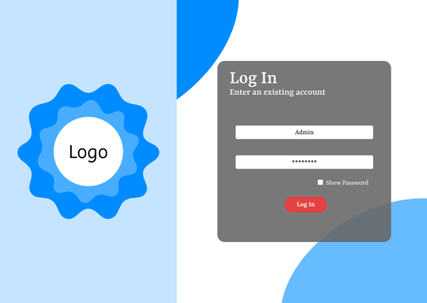
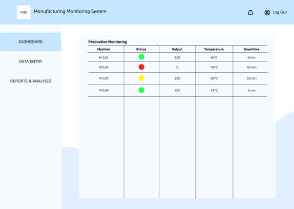
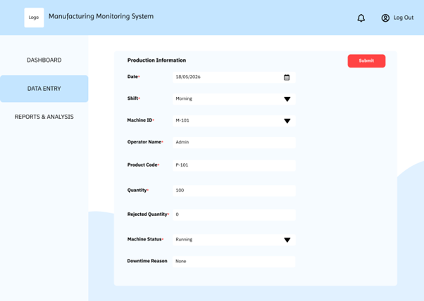
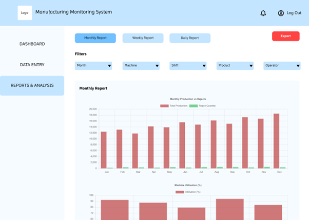

# Digital Transformation Case Study

This repository contains a conceptual proposal aimed at integrating a digital monitoring and analytics platform into manufacturing production environments and workflows to improve efficiency.

---

## 🥅 Project Objectives

- Reduce dependency and inaccurate records on manual paperwork
- Enable real-time reporting for production status
- Improve data avaibility and visualisation for analysis
- Support management in decision-making

---

## 🧠 Proposed Solution

- Digital Data Collection
- Centralised Database
- Real-time Production Dashboard
- Reporting & Analysis Platform

---

## 📁 Repository Structure

- /proposal -> Proposal document with analysis and explanation
- /diagrams -> Architecture, workflow and project timeline diagrams
- /prototypes -> Dashboard example

---

## 📸 Prototype UI

  

  

  

  

---